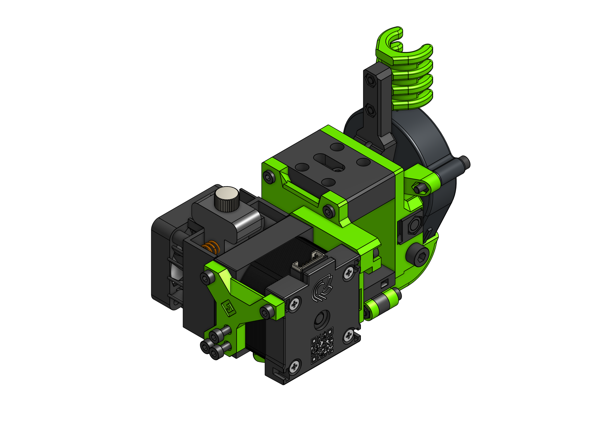

---
badges:
    - Official
---
# Hemera

E3D Hemera is another example of the front heavy EVAs. The motor is huge and the whole extruder takes a lot of space so make sure to understand that the full print volume may not be accessible when using this EVA variant.

??? question "Why not bellow the rail?"

    I tried that on Aero - more informatino there.

Hemera's motor needs to be put on quite early in the assembly process, remember to grab the right belt before putting it on.

### Links

{{ eva_download_button("hemera") }}

{{ eva_link("hemera") }}

{{ onshape_link("hemera") }}

### BOM

{{ bom("drives/hemera/bom/hemera.csv", 0) }}

